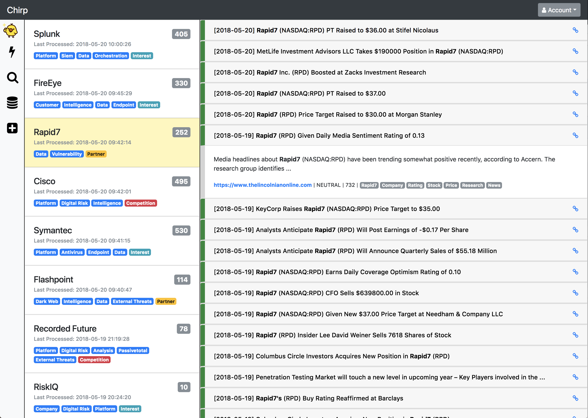

Chirp
=====
Chirp is a metadata platform built on top of Google Alerts meant to manage monitors, alerts and notifications.

Getting Started
---------------

Start redis:

    $ redis-server

Start RabbiqMQ:

    $ rabbitmq-server

Start the Celery beat:

    $ sudo celery worker -A celery_worker.celery --loglevel=info -B

Start the server:

    $ sudo python server.py run

How Does it Work?
-----------------
Chirp takes a set of Google credentials and makes use of the python Google alerts abstract library to create, update and delete monitors. Each monitor is turned into an RSS feed and then managed within Chirp. Asynchronous jobs poll the RSS feeds for new articles, summarizing the content, deriving tag data and then presenting them within the interface. All alert data is presented in one location with additional metadata paired from the user.

Why?
----
Google Alerts by themselves are great for a small number of focused monitors. If you want to direct the Google machine to a larger set of queries, it can quickly become overwhelming for managing and then handling alerts. Chirp was built for cases where Google Alerts was managing a lot of monitors and users needed a way to prioritize the alerting information that came back. Chirp completely abstracts away the Google Alert interface and provides a framework for collecting data on specific topics using Google scale.

State of the Project
--------------------
This platform is a work in progress and is being developed on an "as needed" basis. In other words, not all functionality is implemented and it's far from polished.

Planned Features
~~~~~~~~~~~~~~~~
- **Management**: List, update and delete the deployed monitors
- **Management**: Allow users to setup accounts, manage and invite others
- **Notifications**: Set rule logic to alert users based on tags, news, summary, etc.
- **Analytics**: Simple ingest statistics in the forms of graphs and other charts
- **Usability**: Filtering of monitors by common details
- **Usability**: Story limitation or pagination for cases where counts are much higher
- **Usability**: Social buttons added to articles for quick sharing of content
